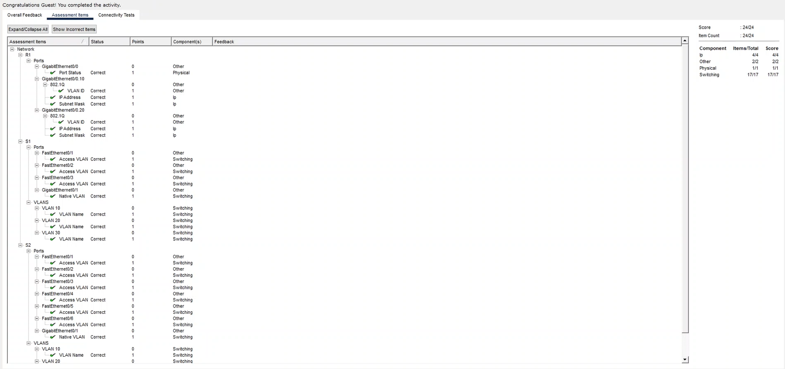

# VLAN Configuration
 ## Table of Contents
 1. Configuring and Verifying VLANS
    - View Default VLAN Configuration  
    - Create and name VLANS
    - Assign Vlans to Ports
    - Configure and Verify Basic Connectivity
 2. Configure Trunks and Native VLANS
    - Configure Trunking Ports
    - Configure Native VLAN
    - Verify Trunk and Native Settings and Connectivity
 3. Configure Router-on-a-Stick
    - Configure Router on a Stick
    - Verify Settings and Inter-VLAN Connectivity
# Configuring and Verifying VLANS

## View Default VLAN Configuration
- Ill access both switches and see what our default vlan configurations are looking like.

## Create and name VLANS
- I simply enter into our CLI on switches 1 and 2, and create our 2 new VLANs, 10 and 20, calling VLAN 10 Worksations, and VLAN 20 Servers

## Assigning VLANs to Ports
- I think within each switch in global configuration then assign each vlan to their associated ports.

## Configure and Verify Basic Connectivity
- It helped going to microsoft whiteboard and visualizing each switch and their assigned IP and subnet mask and default gateway.

- Going into each PC on the network, i manually assigned their static ip of the subnet for VLAN 10.

- Now following that along with each server in our other VLAN, we assigned each server their static IP subnet.

# Configure Trunks and Native VLAN
## Configuring Trunking Ports
- Creating my trunk using our gigabit ethernet on switch 1, and then our gigabit ethernet port 2 as our trunk for our router, then made the same implemenation to switch 2.

## Configuring our Native VLAN
- W/ creating our native VLAN, i made a separate VLAN, which was VLAN 30, named native, we use the port gigabitethernet 1 as it is our trunk, i did this for both switches.

## Verifying Trunk and Native Settings w/ Connectivity
- I think verified that everything was properly implemented and working.

- As you can see we got successful pings and connectivity throughout the entire network.
# Configure Router-on-a-Stick
- Since we have mulitple VLANs, to ccommunicate with eachother , we need to integrate inter-VLAN routing.
## Configuring our Router on a Stick

- Remember we configured our gigabit ethernet2 from switch 1 as trunking to our router, and this is how inter-connect everything. We then create sub-interfaces, gig0/0.10 and gig0/0.20. After creating our sub-interfaces we set our encapsulation type to 802.1Q and assign it to VLAN 10 and 20, so that we can allow the inter-vlan routing.
## Verify Settings and Inter-VLAN Connectivity
- I verified all configurations on my router and test the connectivity of all settings and found that everything has been successful connected and pinged.

